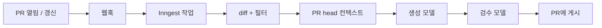

# hreviewer

_다른 언어로 읽기: [English](README.md), [한국어](README.ko.md)_

GitHub Pull Request용 AI 코드 리뷰어. 모든 지적은 두 번째 모델이 diff와 대조해 검증한 뒤에 게시됩니다.

## 무엇을 하는가

PR을 열면 hreviewer가 diff를 읽고, 정확한 head 커밋에서 컨텍스트를 모으고, 리뷰를 작성하고, 각 지적을 diff와 대조해 검증한 뒤 결과를 게시합니다. 전체 파이프라인은 300초 상한 안에서 돌며, 큰 diff는 그 대부분을 씁니다.

게시되는 리뷰는 이런 모습입니다:

````markdown
> ℹ️ 생성 파일 제외: `package-lock.json`, `dist/bundle.js`
>
> 🛡️ **리뷰 검증** — 지적·제안 7개 중 2개는 diff와 달라 걸러냄

## 요약

> **🟡 Medium Risk**

웹훅 디스패처에 재시도 처리를 추가했습니다. 백오프 자체는 타당하지만,
원격이 Retry-After 없이 429를 반환하면 재시도 예산에 상한이 없습니다.

**리뷰 포인트**

- `dispatch.ts`의 무한 재시도 루프
- 429 분기에 대한 테스트 부재

<details>
<summary>

## 변경 사항 상세

</summary>

- 🔧 `lib/dispatch.ts` **(modified)** - send() 주변에 지수 백오프 추가
- ➕ `lib/backoff.ts` **(added)** - 지터 헬퍼 신규

</details>

## 발견된 문제점

### 🚨 CRITICAL · 🐛 bug · `lib/dispatch.ts` - 재시도 루프에 상한이 없음

원격이 `Retry-After` 헤더 없이 429를 응답하면 `delay`가 초기값에 머물러
루프가 종료되지 않습니다.

**영향:** 스로틀링된 엔드포인트 하나가 워커를 무기한 점유할 수 있습니다.

**권장 조치:** 시도 횟수를 `MAX_RETRIES`로 제한하고, 헤더가 없을 때는
고정 백오프로 폴백하세요.

## 개선 제안

...
````

검증 줄은 장식이 아닙니다. 1차 모델이 7개를 냈고, 2차 모델이 각각을 diff와 대조해 diff가 반박하는 2개를 제거한 결과입니다. 제거된 항목은 검증 리뷰의 접힘 블록에 이유와 함께 남습니다.

## 무엇이 다른가

- **2단계 리뷰.** 생성 모델이 지적을 쓰고, 검수 모델이 각각을 diff와 대조해 `CONFIRMED`, `UNCERTAIN`, `REJECTED`로 판정합니다. `REJECTED`만 제거합니다 — 의도적으로 보수적인 필터라서, 그럴듯하지만 확증할 수 없는 지적은 조용히 버려지지 않고 살아남습니다.
- **영구 코드 인덱스 없음.** 컨텍스트는 리뷰 시점에 정확한 PR head 커밋에서 읽습니다 — 변경된 파일과, 제한된 범위의 직접 연관 테스트·import입니다. 임베딩하거나 저장하지 않으므로 컨텍스트가 낡거나 저장소를 넘어 새어나갈 수 없습니다.
- **반복 지적 감지.** 이전 PR에서 같은 문제를 지적받았다면 해당 PR 링크가 배지로 붙습니다.
- **열화를 숨기지 않음.** PR이 너무 커서 구조화 리뷰를 만들지 못했거나 생성 파일을 diff에서 뺐다면, 조용히 축소하지 않고 본문 최상단에 명시합니다.

## 파이프라인



웹훅은 즉시 응답하고 작업을 Inngest에 넘깁니다. GitHub가 모델 호출을 기다리지 않습니다.

## PR에서 사용하기

리뷰는 PR이 열리거나 갱신될 때 자동으로 실행됩니다. PR 코멘트에서 쓸 수 있는 명령은 하나입니다:

```
/hreviewer summary
```

PR 요약을 게시합니다. `@hreviewer summary`도 동작합니다.

## 로컬에서 실행하기

### 사전 준비

- Node.js 20.x 이상
- PostgreSQL 14.x 이상
- GitHub OAuth 앱
- Google AI API 키

> **과금 요건.** 소스 코드를 Google AI로 보내는 모든 환경은 API 키 페이지에 `Plan: Paid`가 표시되고, Cloud Billing이 활성이며, Free가 아닌 청구 등급과 사용 가능한 `Prepay` 또는 `Postpay` 상태인 키를 써야 합니다. `Plan: Free`, `Set up billing`, `Set up Prepay`, `No credits`, 또는 알 수 없는 상태의 키로는 소스를 보내지 마세요. Paid Service도 남용 모니터링을 위한 제한적 프롬프트·응답 로깅이 있을 수 있으며, 무보존이 자동으로 보장되지는 않습니다.

### 설치

```bash
git clone https://github.com/Sangeok/h-reviewer.git
cd h-reviewer
npm install
```

`.env` 파일을 만든 뒤([환경 변수](#환경-변수) 참고):

```bash
npx prisma migrate dev     # 스키마 생성
npm run dev                # http://localhost:3000
```

백그라운드 작업은 별도 프로세스로 실행합니다:

```bash
npm run inngest-dev        # http://localhost:8288
```

### GitHub OAuth 앱

1. [GitHub Developer Settings](https://github.com/settings/developers) → New OAuth App
2. Homepage URL: `http://localhost:3000`
3. Authorization callback URL: `http://localhost:3000/api/auth/callback/github`
4. Client ID와 Secret을 `.env`에 복사

diff를 읽고 리뷰를 게시하기 위해 `repo` 스코프를 요청합니다.

### 웹훅

**웹훅을 직접 설정하지 않습니다.** 대시보드에서 저장소를 연결하면 앱이 `${NEXT_PUBLIC_APP_BASE_URL}/api/webhooks/github`로 웹훅을 자동 등록합니다. 이벤트는 `pull_request`와 `issue_comment`이며 `GITHUB_WEBHOOK_SECRET`으로 서명됩니다.

로컬 개발에서는 서버를 외부에 노출한 뒤, 저장소를 연결하기 **전에** `NEXT_PUBLIC_APP_BASE_URL`을 공개 URL로 맞추세요:

```bash
npm run ngrok              # https://<id>.ngrok.io 발급
```

들어오는 요청은 `GITHUB_WEBHOOK_SECRET` 서명이 맞지 않으면 거부되므로, 웹훅을 받는 모든 환경에 반드시 설정해야 합니다.

## 환경 변수

**필수**

| 변수 | 용도 |
| --- | --- |
| `DATABASE_URL` | PostgreSQL 연결 문자열 |
| `BETTER_AUTH_URL` | 인증 콜백 기준 URL |
| `BETTER_AUTH_SECRET` | 세션 서명 비밀키 (32자 이상) — Better-Auth가 환경에서 직접 읽음 |
| `GITHUB_CLIENT_ID` | OAuth 앱 클라이언트 ID |
| `GITHUB_CLIENT_SECRET` | OAuth 앱 클라이언트 시크릿 |
| `GITHUB_WEBHOOK_SECRET` | 웹훅 서명 검증 — 서명 없는 요청은 거부됩니다 |
| `GOOGLE_GENERATIVE_AI_API_KEY` | 리뷰 생성, 검증, 반복 지적 임베딩 |
| `NEXT_PUBLIC_APP_BASE_URL` | 웹훅 URL 등록에 쓰이는 공개 오리진 |

**선택**

| 변수 | 기본값 | 용도 |
| --- | --- | --- |
| `DETERMINISTIC_PR_CONTEXT_ENABLED` | `true` | 서버 전용. 정확히 `false`일 때만 컨텍스트 수집을 건너뛰는 승인된 diff-only 롤백입니다. 영구 코드 인덱스를 되살리지는 않습니다. |
| `PRO_UPGRADE_ENABLED` | 꺼짐 | 유료 업그레이드 흐름 노출 |
| `POLAR_ACCESS_TOKEN` | — | Polar 구독 |
| `POLAR_SUCCESS_URL` | — | 결제 완료 후 리다이렉트 |
| `POLAR_WEBHOOK_SECRET` | — | Polar 웹훅 검증 |
| `NEXT_PUBLIC_APP_URL` | `http://localhost:3000/dashboard` | 결제 복귀 URL |
| `INNGEST_EVENT_KEY` | — | 프로덕션에서 Inngest SDK가 직접 읽음 |
| `INNGEST_SIGNING_KEY` | — | 프로덕션에서 Inngest SDK가 직접 읽음 |
| `CHECK_MODELS_SOFT` | 꺼짐 | 모델 가용성 빌드 게이트를 경고로 완화 |

`GENERATOR_MODEL`, `VERIFIER_MODELS`, `GENERATION_TIMEOUT_MS`와 `CALIBRATION_*`은 `scripts/verify-calibration.test.ts`에서만 읽으며 앱 동작에는 영향이 없습니다.

## 아키텍처

```
app/
  (auth)/login/              로그인 페이지
  dashboard/                 저장소, 리뷰, 설정, 구독
  api/auth/[...all]/         Better-Auth 엔드포인트
  api/inngest/               Inngest 핸들러 (maxDuration이 리뷰 예산을 결정)
  api/webhooks/github/       서명 검증, 이벤트 라우팅, PR 명령
features/
  ai/                        리뷰 생성, PR head 컨텍스트, 검증, 반복 감지
  auth/  repository/  review/  suggestion/  payment/  settings/  dashboard/
inngest/functions/           review.ts, summary.ts — 비동기 작업
lib/
  github/                    Octokit 래퍼, diff 파서, diff 필터
  db.ts  auth.ts             Prisma 싱글턴, Better-Auth 서버 설정
  generated/prisma/          생성된 Prisma 클라이언트 (커스텀 출력 경로)
shared/                      기능 간 공용 상수·타입 (사용자에게 보이는 라벨이 여기 있음)
scripts/                     모델 가용성 게이트, 캘리브레이션 하네스
docs/                        컨벤션, 명세, 평가 — docs/README.md 참고
```

코딩 컨벤션, 모듈 배치 규칙, Prisma import 규칙은 [CLAUDE.md](CLAUDE.md)에 있습니다. 여기서 반복하지 않습니다.

**데이터 모델:** `User`, `Session`, `Account`, `Repository`, `Review`, `ReviewIssue`, `Suggestion`, `UserUsage`, `Verification`. 스키마는 [`prisma/schema.prisma`](prisma/schema.prisma)에 있습니다.

## 개발

```bash
npm run dev            # 개발 서버
npm run inngest-dev    # 백그라운드 작업
npm test               # vitest
npm run lint           # eslint
npx tsc --noEmit       # 타입 검사
```

### 모델

모든 모델 ID는 `features/ai/constants/index.ts`에 둡니다 — `google("...")` 호출에 문자열을 인라인하면 가용성 검사가 볼 수 없습니다. `preview` 모델과 `-latest` 별칭은 피하세요.

```bash
npm run check-models   # 설정된 모델 프로브
```

`next-build`와 `vercel-build`의 첫 단계로 실행되며, 모델 ID가 실제로 사라졌을 때만(404 / "no longer available") 빌드를 실패시킵니다. 일시적 오류나 API 키 부재는 빌드를 막지 않습니다. 긴급 배포에는 `CHECK_MODELS_SOFT=1`로 우회합니다.

### 데이터베이스 변경

```bash
npx prisma migrate dev --name <description>
npx prisma generate
npx prisma studio                              # GUI
npx prisma migrate deploy                      # 프로덕션
```

### 프로덕션 빌드

`npm run vercel-build`는 `check-models` → `prisma generate` → `prisma migrate deploy` → `next build` 순으로 실행됩니다. `npm run build`는 게이트와 마이그레이션을 건너뛰므로 로컬 빌드 확인용으로만 쓰세요.

## 알려진 한계

- 아주 큰 diff는 비구조화 리뷰로 폴백합니다 — 인라인 제안과 이슈별 검증이 없습니다. 이 경우 본문 최상단에 명시됩니다.
- diff 필터는 lock 파일과 생성 산출물을 제거하지만, 긴 문서 같은 사람이 쓴 파일은 제거하지 않습니다. 삭제된 문서가 대부분인 PR은 여전히 예산을 넘길 수 있습니다.
- 검증 카운트는 이슈와 인라인 제안을 합산하므로, 리뷰 본문에 보이는 지적 수보다 클 수 있습니다.
- 삭제된 파일도 전문이 모델로 전송됩니다.

## 문제 해결

**리뷰가 시작되지 않음.** 대시보드에서 저장소가 연결되어 있는지, 저장소에 `NEXT_PUBLIC_APP_BASE_URL`을 가리키는 웹훅이 있는지, 양쪽 `GITHUB_WEBHOOK_SECRET`이 일치하는지 확인하세요. 서명이 없는 요청은 401로 버려집니다.

**리뷰가 시작되지만 끝나지 않음.** 로컬에서는 Inngest 개발 서버가 떠 있어야 합니다. 프로덕션에서는 Inngest 대시보드에서 `review` 함수를 확인하세요.

**Prisma 클라이언트를 찾을 수 없음.** `npx prisma generate`를 실행하세요. 클라이언트는 `node_modules`가 아니라 `lib/generated/prisma/`에 생성됩니다.

**인증 콜백 오류.** `BETTER_AUTH_URL`이 현재 환경과 일치해야 하고, GitHub OAuth 콜백 URL도 같아야 합니다.

**모델 가용성 때문에 빌드 실패.** 설정된 모델 ID가 더 이상 존재하지 않습니다. `features/ai/constants/index.ts`에서 교체하세요. `CHECK_MODELS_SOFT=1`은 긴급 배포를 뚫을 때만 씁니다.
