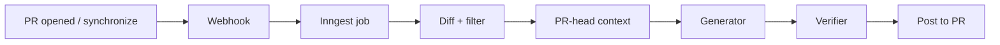

# hreviewer

*Read this in other languages: [English](README.md), [한국어](README.ko.md)*

An AI code reviewer for GitHub pull requests. Every finding is fact-checked against the diff by a second model before it reaches you.

## What it does

Open a pull request. hreviewer reads the diff, gathers context from the exact head commit, writes a review, verifies each finding against the diff, and posts the result. The whole pipeline runs under a 300-second ceiling; large diffs use most of it.

A posted review looks like this:

````markdown
> ℹ️ Skipped generated files: `package-lock.json`, `dist/bundle.js`
>
> 🛡️ **Review Verification** — 2 of 7 findings filtered out (contradicted by the diff)

## Summary

> **🟡 Medium Risk**

Adds retry handling to the webhook dispatcher. The backoff is sound, but the
retry budget is unbounded when the remote returns 429 without Retry-After.

**Review Focus**

- Unbounded retry loop in `dispatch.ts`
- Missing test for the 429 branch

<details>
<summary>

## Walkthrough

</summary>

- 🔧 `lib/dispatch.ts` **(modified)** - Adds exponential backoff around send()
- ➕ `lib/backoff.ts` **(added)** - New jitter helper

</details>

## Issues

### 🚨 CRITICAL · 🐛 bug · `lib/dispatch.ts` - Retry loop has no ceiling

When the remote replies 429 without a `Retry-After` header, `delay` stays at
its initial value and the loop never exits.

**Impact:** A single throttled endpoint can pin a worker indefinitely.

**Recommendation:** Cap attempts at `MAX_RETRIES` and fall back to a fixed
backoff when the header is absent.

## Suggestions

...
````

The verification line is not decoration. The first model produced 7 findings; a second model checked each one against the diff and removed 2 that the diff contradicts. Removed findings are kept in a collapsed block on the verification review, with the reason.

## How it differs

- **Two-stage review.** A generator model writes findings; a verifier model judges each one against the diff and returns `CONFIRMED`, `UNCERTAIN`, or `REJECTED`. Only `REJECTED` is removed — the filter is deliberately conservative, so a plausible-but-unprovable finding survives rather than being silently dropped.
- **No persistent code index.** Context is read from the exact PR head commit at review time: the changed files plus a bounded set of directly related tests and imports. Nothing is embedded or stored, so context can never be stale or leak across repositories.
- **Repeat-issue detection.** If the same problem was raised on an earlier PR, the finding is tagged with a link to it.
- **Degradation is visible.** When a PR is too large for a structured review, or when generated files were dropped from the diff, the review says so at the top instead of quietly returning less.

## Pipeline



The webhook returns immediately and hands the work to Inngest, so GitHub never waits on a model call.

## Using it on a pull request

Reviews run automatically when a PR is opened or updated. One command is available in PR comments:

```
/hreviewer summary
```

Posts a summary of the pull request. `@hreviewer summary` works too.

## Running locally

### Prerequisites

- Node.js 20.x or higher
- PostgreSQL 14.x or higher
- A GitHub OAuth app
- A Google AI API key

> **Billing requirement.** Any environment that sends source code to Google AI must use a key whose API-key page shows `Plan: Paid`, with active Cloud Billing, a non-Free billing tier, and a usable `Prepay` or `Postpay` state. Do not send source code with a key showing `Plan: Free`, `Set up billing`, `Set up Prepay`, `No credits`, or an unknown state. Paid Service can still include limited prompt/response logging for abuse monitoring — zero-data retention is not automatic.

### Setup

```bash
git clone https://github.com/Sangeok/h-reviewer.git
cd h-reviewer
npm install
```

Create a `.env` file (see [Environment variables](#environment-variables)), then:

```bash
npx prisma migrate dev     # create the schema
npm run dev                # http://localhost:3000
```

Background jobs run in a separate process:

```bash
npm run inngest-dev        # http://localhost:8288
```

### GitHub OAuth app

1. [GitHub Developer Settings](https://github.com/settings/developers) → New OAuth App
2. Homepage URL: `http://localhost:3000`
3. Authorization callback URL: `http://localhost:3000/api/auth/callback/github`
4. Copy the client ID and secret into `.env`

The app requests the `repo` scope so it can read diffs and post reviews.

### Webhooks

**You do not configure webhooks by hand.** When you connect a repository in the dashboard, the app registers one for you at `${NEXT_PUBLIC_APP_BASE_URL}/api/webhooks/github` with the `pull_request` and `issue_comment` events, signed with `GITHUB_WEBHOOK_SECRET`.

For local development, expose your server and point `NEXT_PUBLIC_APP_BASE_URL` at the public URL before connecting a repository:

```bash
npm run ngrok              # gives you https://<id>.ngrok.io
```

Incoming deliveries are rejected unless the signature matches `GITHUB_WEBHOOK_SECRET`, so it must be set in every environment that receives webhooks.

## Environment variables

**Required**

| Variable | Purpose |
| --- | --- |
| `DATABASE_URL` | PostgreSQL connection string |
| `BETTER_AUTH_URL` | Auth callback base URL |
| `BETTER_AUTH_SECRET` | Session signing secret (32+ chars) — read by Better-Auth from the environment |
| `GITHUB_CLIENT_ID` | OAuth app client ID |
| `GITHUB_CLIENT_SECRET` | OAuth app client secret |
| `GITHUB_WEBHOOK_SECRET` | Webhook signature verification — unsigned deliveries are rejected |
| `GOOGLE_GENERATIVE_AI_API_KEY` | Review generation, verification, repeat-issue embeddings |
| `NEXT_PUBLIC_APP_BASE_URL` | Public origin used to register webhook URLs |

**Optional**

| Variable | Default | Purpose |
| --- | --- | --- |
| `DETERMINISTIC_PR_CONTEXT_ENABLED` | `true` | Server-only. Exactly `false` skips context collection for an approved diff-only rollback. It never re-enables a persistent code index. |
| `PRO_UPGRADE_ENABLED` | off | Exposes the paid upgrade flow |
| `POLAR_ACCESS_TOKEN` | — | Polar subscriptions |
| `POLAR_SUCCESS_URL` | — | Post-checkout redirect |
| `POLAR_WEBHOOK_SECRET` | — | Polar webhook verification |
| `NEXT_PUBLIC_APP_URL` | `http://localhost:3000/dashboard` | Checkout return URL |
| `INNGEST_EVENT_KEY` | — | Read by the Inngest SDK in production |
| `INNGEST_SIGNING_KEY` | — | Read by the Inngest SDK in production |
| `CHECK_MODELS_SOFT` | off | Downgrades the model availability build gate to a warning |

`GENERATOR_MODEL`, `VERIFIER_MODELS`, `GENERATION_TIMEOUT_MS`, and the `CALIBRATION_*` variables are read only by `scripts/verify-calibration.test.ts` and have no effect on the app.

## Architecture

```
app/
  (auth)/login/              Login page
  dashboard/                 Repositories, reviews, settings, subscription
  api/auth/[...all]/         Better-Auth endpoints
  api/inngest/               Inngest handler (maxDuration governs the review budget)
  api/webhooks/github/       Signature check, event routing, PR commands
features/
  ai/                        Review generation, PR-head context, verification, repeat detection
  auth/  repository/  review/  suggestion/  payment/  settings/  dashboard/
inngest/functions/           review.ts, summary.ts — the async jobs
lib/
  github/                    Octokit wrapper, diff parser, diff filter
  db.ts  auth.ts             Prisma singleton, Better-Auth server config
  generated/prisma/          Generated Prisma client (custom output path)
shared/                      Cross-feature constants and types (user-facing labels live here)
scripts/                     Model availability gate, calibration harness
docs/                        Conventions, specs, evaluations — see docs/README.md
```

Coding conventions, the module layout rules, and the Prisma import rule are in [CLAUDE.md](CLAUDE.md). They are not repeated here.

**Data model:** `User`, `Session`, `Account`, `Repository`, `Review`, `ReviewIssue`, `Suggestion`, `UserUsage`, `Verification`. Schema in [`prisma/schema.prisma`](prisma/schema.prisma).

## Development

```bash
npm run dev            # dev server
npm run inngest-dev    # background jobs
npm test               # vitest
npm run lint           # eslint
npx tsc --noEmit       # type check
```

### Models

Every model ID lives in `features/ai/constants/index.ts` — never inline a string in a `google("...")` call, or the availability check cannot see it. Avoid `preview` models and `-latest` aliases.

```bash
npm run check-models   # probe configured models
```

This runs first in `next-build` and `vercel-build`, and fails the build when a model ID is genuinely gone (404 / "no longer available"). Transient errors and a missing API key do not block. `CHECK_MODELS_SOFT=1` overrides it for emergency deploys.

### Database changes

```bash
npx prisma migrate dev --name <description>
npx prisma generate
npx prisma studio                              # GUI
npx prisma migrate deploy                      # production
```

### Production build

`npm run vercel-build` runs `check-models` → `prisma generate` → `prisma migrate deploy` → `next build`. Plain `npm run build` skips the gate and the migration step, so use it only for local build checks.

## Known limitations

- Very large diffs fall back to an unstructured review — no inline suggestions and no per-issue verification. The review says so at the top when this happens.
- The diff filter drops lock files and generated output, but not human-written files such as long documentation. A PR dominated by deleted docs can still exceed the budget.
- The verification count combines issues and inline suggestions, so it can be larger than the number of findings visible in the review body.
- Deleted files are still sent to the model in full.

## Troubleshooting

**Reviews never start.** Check that the repository is connected in the dashboard, that a webhook exists on the repository pointing at your `NEXT_PUBLIC_APP_BASE_URL`, and that `GITHUB_WEBHOOK_SECRET` matches on both sides. Unsigned deliveries are dropped with a 401.

**Reviews start but never finish.** The Inngest dev server must be running locally. In production, check the Inngest dashboard for the `review` function.

**Prisma client not found.** Run `npx prisma generate`. The client is emitted to `lib/generated/prisma/`, not `node_modules`.

**Auth callback errors.** `BETTER_AUTH_URL` must match the environment you are on, and the GitHub OAuth callback URL must match it too.

**Build fails on model availability.** A configured model ID no longer exists. Update it in `features/ai/constants/index.ts`; use `CHECK_MODELS_SOFT=1` only to unblock an emergency deploy.
